<div align="center">

# 🧬 Evo

**Experience the emergence of complex behaviors from simple rules, just like nature intended.**

[](https://github.com/CodeByBryant/Evo/actions/workflows/ci.yml)
[](https://github.com/CodeByBryant/Evo/actions/workflows/deploy-web.yml)
[](https://opensource.org/licenses/MIT)
[](https://www.typescriptlang.org/)
[](https://react.dev/)

[**🎮 Play Online**](https://codebybryant.github.io/Evo/) • [**📥 Download**](https://github.com/CodeByBryant/Evo/releases) • [**📖 Documentation**](./docs/README.md)

</div>

---

## 🌟 About Evo

> **Evo** is an advanced neural network-based evolutionary sandbox where AI agents evolve through natural selection.

Agents navigate an **infinite 2D world**, sense their environment using raycasting, and make decisions through neural networks that evolve over generations. Watch species emerge, compete for resources, and evolve complex behaviors in real-time!

```typescript
const evo = {
    type: "Neural Evolution Sandbox",
    features: ["Genetic Algorithms", "Neural Networks", "Infinite World", "Species Tracking"],
    inspiration: ["Cell Lab", "Thrive", "The Life Engine", "Bionic Chaos Evolution"],
    goal: "Watch AI evolve complex behaviors from simple rules 🧬"
};
```

---

## 🚀 Quick Start

<div align="center">

### Play Online (No Installation Required)

[](https://codebybryant.github.io/Evo/)

</div>

### 📥 Download Desktop App

<div align="center">

| Platform | Download |
|:--------:|:--------:|
|  | [📥 Download .exe](https://github.com/CodeByBryant/Evo/releases/latest) |
|  | [📥 Download .dmg](https://github.com/CodeByBryant/Evo/releases/latest) |
|  | [📥 Download .AppImage](https://github.com/CodeByBryant/Evo/releases/latest) |

</div>

---

## ✨ Features

<table>
<tr>
<td width="50%">

### 🧬 Evolution & Genetics
- **Full Genetic Algorithm**: Reproduction, crossover, mutation, and natural selection
- **Generational Evolution**: Watch populations evolve over hundreds of generations
- **DNA Visualization**: Beautiful animated double helix showing agent genomes
- **Species Tracking**: Automatic species identification with color coding
- **Configurable Evolution**: Adjust mutation rates, selection pressure, and more

</td>
<td width="50%">

### 🧠 Advanced Neural Networks
- **Multi-Layer Perceptron**: Configurable architecture with modern activation functions
- **Crossover Reproduction**: Genetic combination from two parents
- **Adaptive Mutation**: Gaussian and uniform mutation strategies
- **Weight Initialization**: Xavier and He initialization methods
- **Activation Functions**: Swish, ELU, Leaky ReLU, Tanh

</td>
</tr>
<tr>
<td width="50%">

### 🌍 Infinite World
- **Infinite Scrollable Map**: Pan and zoom through an endless 2D world
- **Camera Controls**: Middle/Right mouse to pan, scroll to zoom
- **Smooth Navigation**: Explore the ecosystem from different perspectives
- **Dynamic Grid**: Visual grid that adapts to zoom level

</td>
<td width="50%">

### 📊 Evolution Tracking
- **Real-Time Charts**: Population and fitness graphs over generations
- **Live Statistics**: Generation, species count, avg/max fitness
- **Performance Metrics**: FPS counter and simulation status
- **Historical Data**: Track evolution progress over 50+ generations

</td>
</tr>
</table>

---

## 💻 Tech Stack

<div align="center">


</div>

---

## 🎮 Controls

<div align="center">

| Action | Control |
|:------:|:-------:|
| **Select Agent** | Left Click |
| **Pan Camera** | Middle Mouse / Right Mouse / Ctrl+Click |
| **Zoom** | Mouse Wheel |
| **Deselect** | Click Empty Space |

</div>

### Simulation Controls
- **Start/Pause**: Toggle simulation execution
- **Reset**: Start fresh with new random population
- **Speed Slider**: Adjust simulation speed (0.1x - 3.0x)

### Evolution Settings
- **Generation Time**: How long each generation lasts
- **Selection Rate**: Percentage of top performers that survive
- **Mutation Rate**: Probability of genetic mutations
- **Population Size**: Target number of agents

---

## 🧬 How Evolution Works

```mermaid
graph LR
    A[🌱 Birth] --> B[🏃 Life]
    B --> C{Energy?}
    C -->|High| D[🔄 Reproduce]
    C -->|Low| E[💀 Death]
    D --> F[🧬 Crossover & Mutation]
    F --> A
    E --> G[📊 Selection]
    G --> A
```



### The Evolution Cycle

1. **🌱 Life Cycle** - Agents consume food, expend energy, and age
2. **🔄 Reproduction** - Fit agents reproduce through crossover and mutation
3. **📊 Natural Selection** - Top performers survive, weak are eliminated
4. **🌈 Speciation** - Species naturally emerge with unique colors

---

## 🛠️ Development

### Prerequisites
- Node.js (v18 or later)
- npm or yarn

### Installation

```bash
# Clone the repository
git clone https://github.com/CodeByBryant/Evo.git
cd Evo

# Install dependencies
npm install

# Start web development server
npm run dev:web

# (Optional) Run as Electron desktop app
npm run dev
```

### Available Scripts

```bash
# Web
npm run dev:web      # Start Vite dev server
npm run build:web    # Build for production

# Desktop
npm run dev          # Start Electron app
npm run build:win    # Build for Windows
npm run build:mac    # Build for macOS
npm run build:linux  # Build for Linux

# Code Quality
npm run lint         # Lint code
npm run format       # Format with Prettier
npm run typecheck    # TypeScript checking
```

---

## 🔮 What Makes Evo Special

<div align="center">

| Feature | Description |
|:-------:|:-----------:|
| 🌍 **Infinite World** | Unlike bounded simulations, agents exist in endless space |
| 🔬 **Real Genetics** | True crossover and mutation, not simplified rules |
| 🌈 **Species Emergence** | Natural speciation without manual intervention |
| ⚡ **Performance** | Handles 100+ agents at 60 FPS |

</div>

---

## 🤝 Contributing

Contributions are welcome! Feel free to:
- 🐛 Report bugs via GitHub Issues
- 💡 Submit feature requests
- 🔧 Create pull requests with improvements
- 🧬 Share your evolved populations

---

## 📄 License

This project is licensed under the **MIT License**. See the [LICENSE](./LICENSE) file for details.

---

<div align="center">

## 👨‍💻 Author

Developed with ❤️ by **Bryant Ejorh** ([@CodeByBryant](https://github.com/CodeByBryant))

[](https://codebybryant.github.io/Portfolio/)
[](https://github.com/CodeByBryant)

---

### 💭 "_Watch evolution in action! Experience the emergence of complex behaviors from simple rules._"

### ⭐ Star this repo if you find it interesting!

**Made with ❤️ and lots of ☕**

</div>
