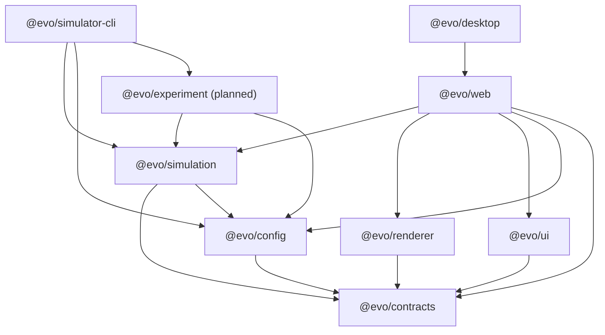

# Package dependency diagram

Arrows point from a package to what it is allowed to depend on. `experiment` does not exist yet (Phase 8); its rules are defined so the graph does not change when it lands.

## Rules

| Package         | May depend on                                         |
| --------------- | ----------------------------------------------------- |
| `contracts`     | nothing internal                                      |
| `config`        | `contracts`                                           |
| `simulation`    | `contracts`, `config`                                 |
| `renderer`      | `contracts`                                           |
| `ui`            | `contracts`                                           |
| `experiment`    | `simulation`, `config`                                |
| `web`           | `simulation`, `renderer`, `ui`, `config`, `contracts` |
| `desktop`       | `web`                                                 |
| `simulator-cli` | `simulation`, `config`, `experiment`                  |

`web` also lists `config` and `contracts` because applications read presets and share types directly. The roadmap's list is the minimum; these two are the only additions.

The simulation package must never depend on or import React, Vite, Electron, PixiJS, the DOM, Canvas, or `localStorage`.

## Enforcement

| Mechanism                          | Where                                                            | Catches                                                                                                                            |
| ---------------------------------- | ---------------------------------------------------------------- | ---------------------------------------------------------------------------------------------------------------------------------- |
| `tools/check-dependency-rules.mjs` | `pnpm lint` (CI: Lint)                                           | Disallowed `@evo/*` dependencies in any `package.json`, disallowed `@evo/*` imports in source, forbidden externals in `simulation` |
| TypeScript config                  | `packages/simulation/tsconfig.json` (`lib: ES2022`, `types: []`) | DOM, Node, and `localStorage` references fail `pnpm typecheck`                                                                     |
| ESLint                             | `eslint.config.js`, `packages/simulation/src/**`                 | `Math.random`, `Date.now`, `new Date()`, `performance.now`, browser globals, UI/bundler imports, `any`, `console`                  |
| Tests                              | `tools/check-dependency-rules.test.mjs`                          | Regressions in the checker itself                                                                                                  |

To change an allowed edge, update `ALLOWED` in the checker and this document in the same PR, and record the reason in an ADR if it affects the simulation boundary.
